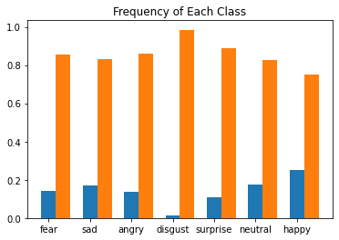

# Facial_Expression_Recognition
## Modules
- OpenCV
- TensorFlow
- Flask
- Numpy
## How to use
- Clone/download
- Select the model_weights.h5,model.json that you want to test with
- Replace them/use the one in Facial_Expression_Recognition folder
- Run main.py file
- Open browser and go to 0.0.0:5000
# Info
- Trained on a dataset published in Kaggle compitition and got around 65% accuracy(71% is accuracy of winner)
- Dataset contains Imbalenced data on 7 Universal expressions
- Done 2 recognition system one with inbuilt 'categorical_crossentropy' loss and another with custom 'weighted_categorical_crossentropy' to counter class Imbalence


- Positive:Blue
- Negative:Orange

```
def get_weighted_loss(pos_weights, neg_weights, epsilon=1e-7):
  def weighted_loss(y_true,y_pred):
    loss = 0.0
    for i in range(len(pos_weights)):
       loss += K.mean(-1*(pos_weights[i]*y_true[:,i]*K.log(y_pred[:,i]+epsilon)+neg_weights[i]*(1-y_true[:,i])*K.log(1-y_pred[:,i]+epsilon)))
    return loss
  return weighted_loss
```
- Deployed Model using Flask
